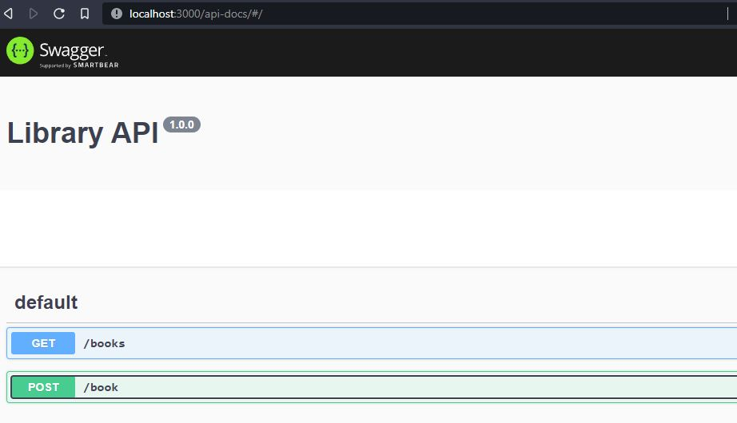

<h1>Swagger with express</h1>
<h2>Description</h2>
Use Swagger to display the Library API created for this project
YAML is used to document API

The syntax to Post to /book route is {"title": "name of book to post"}

<h2>Instructions</h2>
<li>Download files</li>
<li>Run npm install to add dependencies</li>
<li>Run npm start to start nodemon</li>
<li>Open browser to localhost:3000/api-docs</li>

